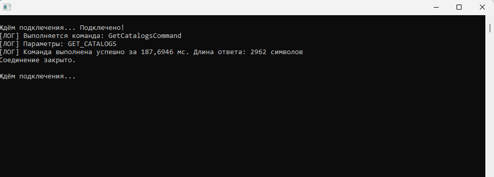

# Сборка компьютеров на заказ

Разработанное приложение автоматизирует процессы заказа сборки компьютеров, учёта комплектующих, клиентов, каталогов, доходов и расходов компании.

## Интерфейс приложения

## Функциональные возможности

- **Авторизация** пользователей.  
Хранение паролей в виде **хеша**.
- **Информация о каталогах и товарах** – просмотр, добавление, редактирование, удаление.
- **Поиск каталогов и товаров с фильтрами**
- **Два способа взаимодействия с БД**:
  - Через **сырые SQL-запросы**
  - Через **ORM** (Entity Framework Core)

## Архитектура

Приложение построено по **клиент-серверной** модели:

- **Консольный проект** (`Server`) – выполняет роль сервера:
  - Обрабатывает бизнес-логику.
  - Взаимодействует с БД (SQL Server).
  - Предоставляет API через **TCP-сокеты**.
- **Оконный проект** (`Client`) – WPF приложение:
  - Отправляет запросы на сервер по TCP.
  - Отображает данные и обрабатывает ввод пользователя.
- **Протокол обмена** – JSON-сообщения поверх TCP.

---

## Технологии

| Компонент          | Технология                            |
|--------------------|---------------------------------------|
| Язык               | C# (.NET 4.6.1) |
| ORM                | Entity Framework Core (3.1.32) |
| База данных        | Microsoft SQL Server (LocalDB) (2016, 13.0) |
| Тестирование       | xUnit (в процессе) |
| Оконный клиент     | Windows Forms |
| Сетевое взаимодействие | TCP сокеты (библиотека `System.Net.Sockets`) |
| Хеширование паролей | SHA256 |
| Шаблон проектирования | Команда, Декоратор |

---

## Реализованные паттерны

### Команда (Command)
Каждое действие (логин, добавление компонента, поиск) обёрнуто в отдельный класс, реализующий интерфейс `ICommand`. Это позволило убрать громоздкий `switch` в обработчике клиента и легко добавлять новые команды

### Декоратор (Decorator)
Для логирования времени выполнения команд и перехвата ошибок реализован `LoggerDecoratorCommand`, который оборачивает любую команду и автоматически пишет в консоль сервера информацию о вызове, длительности и результате

## Диаграммы и схемы

---

## Структура базы данных

Основные таблицы:

- `Clients` (id, full_name, phone, email, address, password)
- `Components` (Id, name, type, purchase_price, retail_price, stock_quantity)
- `Catalogs` (id, name, type, description, price)
- `Finances` (id, order_id - связь с заказами, type, price)
- `Order_comnponents` (id, order_id - связь с заказами, component id - связь с компелктующими, quantity)
- `Orders` (id, client_id - связь с клиентами, catalog_id - связь с каталогами, date, status, price)

Создание и заполнение БД в скрипте `SQLQuery1.sql`
Для запуска скрипта нажмите "Файл" - "Открыть" - "Файл". Выберите файл `SQLQuery1.sql` и нажмите кнопку "Выполнить" (F5)

---

## Установка и запуск

### Требования
- [.NET 4.6.1 SDK](https://dotnet.microsoft.com/download)
- [Visual Studio 2022](https://visualstudio.microsoft.com/) (с нагрузкой «Разработка классических приложений .NET»)
- [SQL Server LocalDB 2016](https://www.microsoft.com/ru-ru/download/details.aspx?id=56836)

### Запуск

1. Откройте решение `Bojechki.sln` в Visual Studio 2022.
2. Выполните сборку решения (Build → Build Solution).
3. После сборки исполняемые файлы появятся в папках:
   - Клиент: `Bojechki\bin\Release\Bojechki.exe`
   - Сервер: `Bojechki_server\bin\Release\Bojechki_server.exe`
4. Запустите сначала сервер, затем клиент (можно при помощи F5 в Visual Studio 2022).
5. Для упрощения используйте прилагаемый файл `run.bat`.

> **Примечание:** Для работы требуется SQL Server LocalDB (устанавливается вместе с Visual Studio или отдельно).

## Тестирование

Проект содержит модульные и сквозные тесты на xUnit. Для их запуска:

1. Откройте `Bojechki.sln` в Visual Studio
2. В меню выберите **Тест → Обозреватель тестов**
3. Нажмите **Запустить все тесты**

## Автор
Тимофеев А. М. - 0483-05